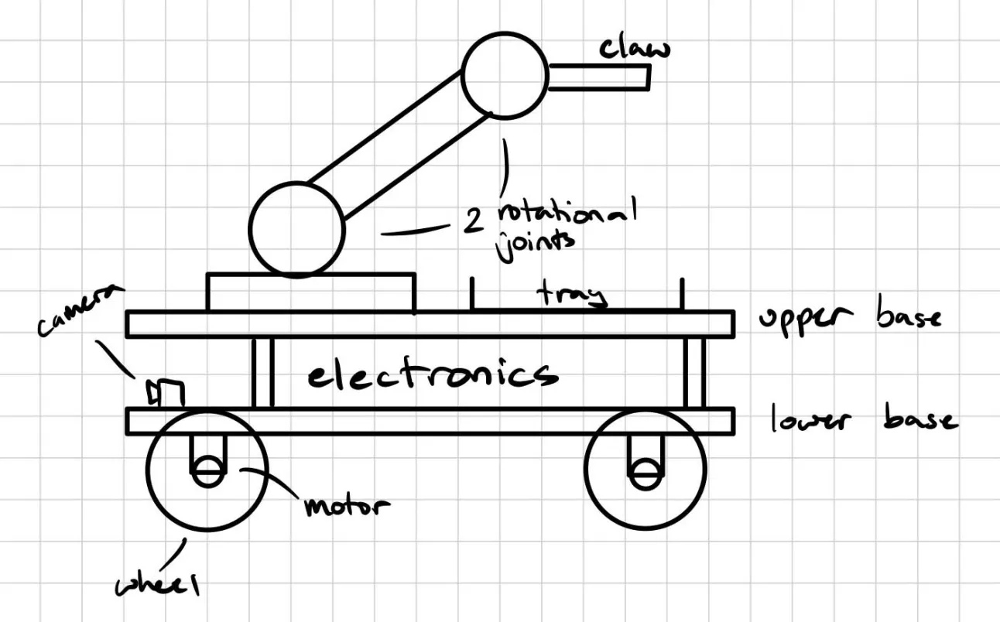
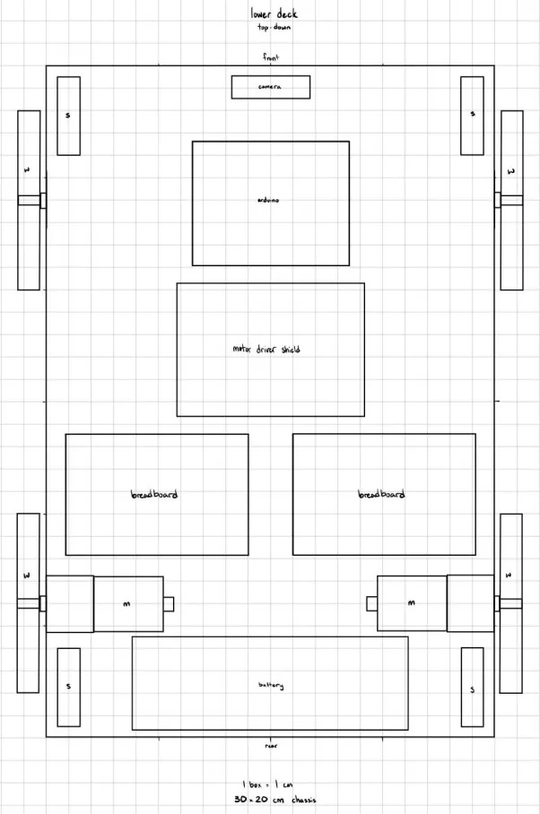
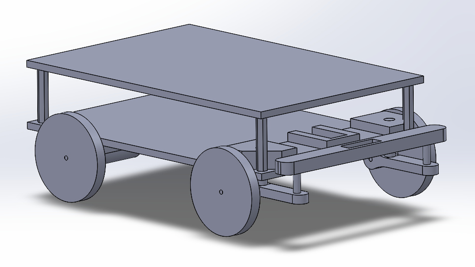
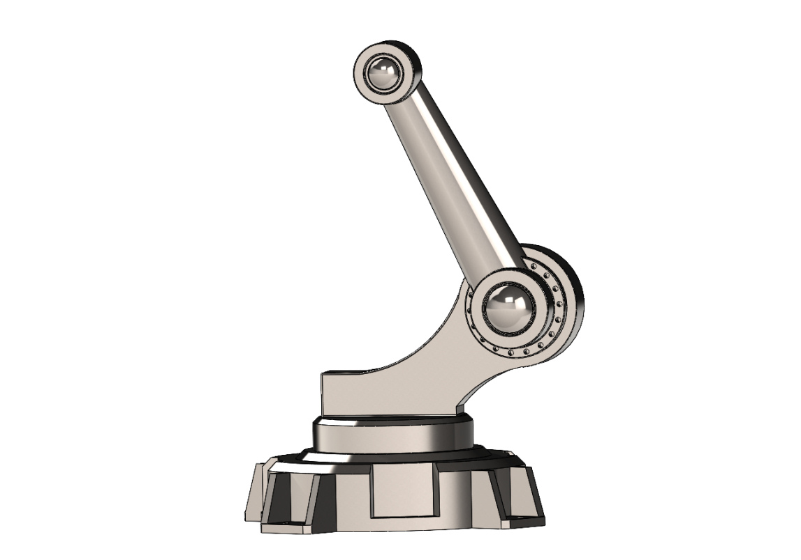

# SEDS @ UCI — Autonomous Mars Rover

**Organization:** Students for the Exploration and Development of Space, UC Irvine  
**Role:** Fabrication Subteam — Mechanical Design & Assembly  
**Status:** In Progress — CAD complete, fabrication upcoming  
**Timeline:** November 2025 – Present

---

## Project Overview

SEDS @ UCI's rover project gives undergraduate engineering students hands-on project team experience before joining competitive organizations like FSAE or rocketry teams. The mission: design, fabricate, assemble, and program a fully autonomous rover capable of traversing uneven terrain (grass and dirt), locating a rock sample, picking it up with a claw mechanism, storing it on board, and returning to the starting point — all without human input.

The project spans four subteams: fabrication, electrical, software, and documentation. I work on the fabrication subteam, responsible for the design and fabrication of the physical structure of the rover and the integration of all mechanical subsystems.

---

## My Contributions

- Developed initial system-level sketches defining the overall rover architecture, component layout, and subsystem relationships
- Produced a scaled layout drawing of the electronics bay, mapping component placement between the upper and lower decks of the chassis
- Modeled the full chassis assembly in SolidWorks, including the dual-deck structure, frame, wheels, and motor mounts
- Integrated the turning mechanism (modeled by a teammate) into the chassis assembly
- Responsible for assembling the arm and claw subassemblies into the full rover model as CAD progresses
- Evaluating material options and fabrication methods — chassis will be built from plywood, arm and claw components will be FDM 3D printed

---

## Design Process

### System Concept Sketch
*Initial sketch of the full rover — brainstormed as a team, drawn by me.*

The sketch defines the core architecture: a two-deck chassis housing electronics between the decks, four driven wheels with motors, a front-facing camera, a two-link arm with rotational joints, and a claw end effector for sample retrieval.

---

### Electronics Bay Layout
*Top-down layout of the lower deck electronics bay — drawn to scale (1 box = 1 cm) on a 30 × 20 cm chassis footprint.*

This drawing maps the placement of the Arduino, motor driver shield, dual breadboards, battery pack, motors, and camera within the constrained space between decks. The goal was to confirm all components fit within the chassis footprint before committing to CAD, and to communicate the layout clearly to the electrical subteam.

---

### Chassis CAD Assembly
*SolidWorks model of the chassis — modeled by me. Turning mechanism integrated from teammate's model.*

The chassis features a two-deck platform supported by a structural frame, with motor mounts and wheel hubs positioned for the four-wheel drive configuration. The turning mechanism is mounted at the rear and was modeled separately by a teammate — I integrated it into the assembly and resolved the interface geometry.

---

### Arm Assembly
*SolidWorks model of the two-DOF arm — modeled by teammate, to be integrated into chassis assembly by me.*

The arm uses two rotational joints and ball bearing interfaces at each joint for smooth actuation. It will mount to the upper deck of the chassis and extend forward to position the claw for sample retrieval. Integration into the full assembly is in progress.

---

## Full System Architecture

| Subsystem | Description | Modeled by |
|---|---|---|
| Chassis | Dual-deck frame, wheels, motor mounts | Me |
| Turning mechanism | Rear steering assembly | Teammate |
| Arm | 2-DOF articulated arm with bearings | Teammate |
| Claw | End effector for rock sample retrieval | Teammate |
| Electronics | Arduino, motor drivers, battery, camera | Electrical subteam |
| Autonomy | Navigation and control software | Software subteam |

---

## Fabrication Plan

- **Chassis decks and frame:** Plywood — lightweight, easy to cut and drill, low cost for prototyping
- **Arm and claw:** FDM 3D printed — allows complex geometry, easy iteration
- **Fasteners and hardware:** Off-the-shelf bolts, standoffs, and bearings

Full assembly CAD will be completed before fabrication begins. Updated renders will be added here once the complete rover model is finished.

---

## Tools & Skills Used

`SolidWorks` `Parametric Modeling` `Assembly Design` `GD&T` `FDM 3D Printing` `Technical Sketching` `Cross-disciplinary Coordination` `Design Review`

---

## Status & Next Steps

- [x] System concept sketches
- [x] Electronics bay layout
- [x] Chassis CAD model
- [x] Turning mechanism integration
- [ ] Arm and claw integration into full assembly
- [ ] Final assembly render
- [ ] Fabrication — chassis
- [ ] Fabrication — 3D printed components
- [ ] Full rover assembly and testing
